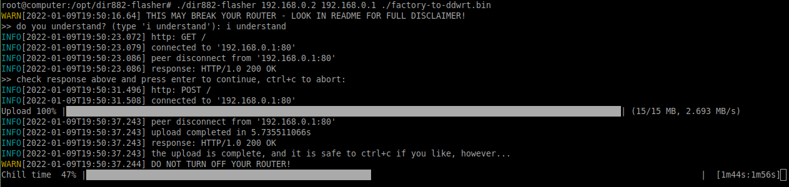

# dir882-flasher
One problem with the D-Link DIR-882 is that you can only upload firmware using Internet Explorer. IE is going away, and I don't use windows anyway. Also, I tend to break my router every now and then, so being able to flash it is an important feature. So I gave this a "go". Just for the funs.

This will only work with D-Link DIR-882. But it should work with any firmware compatible with that router. I have flashed DD-WRT and OpenWRT successfully.

My packet analysis for the IE upload is available in [analysis.md](analysis.md).

Successful execution:


# DISCLAIMERS
## 1 - STUFF WILL BREAK
**I take no responsibility for this**. You use it - you are on your own. Here are some things that may happen if you use this software:
- Your device may be [demaged](success.pretty.html)\[sic!] beyond repair
- Your house might burn to the ground
- Your dog might eat your sneakers

I take no responsibility for anything listed above, or anything else.

Also good to know: I am not affiliated with either D-Link or DD-WRT. I have no idea what I'm doing here.

This is on you.

**YOU HAVE BEEN WARNED!**

## 2 - PCAP data
The provided [pcap](router.pcap) contains firmware for the DIR-882 from DD-WRT, `v3.0 [Beta] Build 44715` to be specific. **The pcap is only provided for documentation**, and you should download it from <https://dd-wrt.com/> if you wish to use it.

## 3 - yeah, i know...
I have never written a TCP/IP stack before, and you might argue that I still haven't. The code is pretty ugly and specific, ironically not unlike IE and the DIR-882. I have used this successfully in Linux. I have no idea if there is even has a chance of working on anything else, like Windows.

# Usage
I am assuming the router is called `192.168.0.1` and the client is called `192.168.0.2`. No sanity checks are performed, it will upload whatever to anything. Pretty much no error checking also. Yeah, not my best work.

## Setup
### Build
```
go build .
```
Pro tip: do this *before* you unplug your router, as go will download a bunch of packages.

### Become root
Since we are doing some pretty low-level stuff here, root will be required.
```
sudo bash
```

### Block RST
As we are not actually opening a socket here (as far as the kernel is concerned) we have to block the kernel from sending `RST`'s. What happens is that the kernel is seeing replies from the router to ports that the kernel think is closed. The kernel then tries to tell the router (and us) to stop talking by sending `RST`.

So let's stop all the `RST`'s for a while:
```
iptables -I INPUT -p tcp --tcp-flags ALL RST,ACK -j DROP
iptables -I INPUT -p tcp --tcp-flags ALL RST -j DROP
iptables -I OUTPUT -p tcp --tcp-flags ALL RST,ACK -j DROP
iptables -I OUTPUT -p tcp --tcp-flags ALL RST -j DROP
```
**or, for development use only:**
```
iptables -t filter -I OUTPUT -p tcp --dport 8000 --tcp-flags RST RST -j DROP
iptables -t filter -I OUTPUT -p tcp --sport 8000 --tcp-flags RST RST -j DROP
```
Developer note: something funky is happening when talking to local VM's, and occasional RST's end up at the server side. The client doesn't see the RST's though, so everything just hangs. Do server on localhost, or a separate computer. It can probably be solved by installed the same rules on the server.

## Flash
```
./dir882-flasher 192.168.0.2 192.168.0.1 /path/to/firmware.bin
```

## Restore

### Restore RST
`RST`'s are actually great, so:
```
iptables -D INPUT -p tcp --tcp-flags ALL RST,ACK -j DROP
iptables -D INPUT -p tcp --tcp-flags ALL RST -j DROP
iptables -D OUTPUT -p tcp --tcp-flags ALL RST,ACK -j DROP
iptables -D OUTPUT -p tcp --tcp-flags ALL RST -j DROP
```
**or, for development use only:**
```
iptables -t filter -D OUTPUT -p tcp --dport 8000 --tcp-flags RST RST -j DROP
iptables -t filter -D OUTPUT -p tcp --sport 8000 --tcp-flags RST RST -j DROP
```

# Acknowledgements
- Obviously DD-WRT: <https://dd-wrt.com/>
- I learned about raw packets in go from this github repo: <https://github.com/kdar/gorawtcpsyn/blob/master/main.go>
